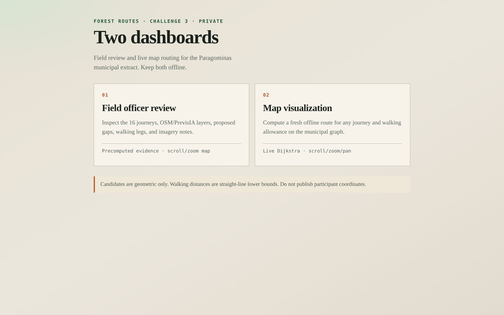
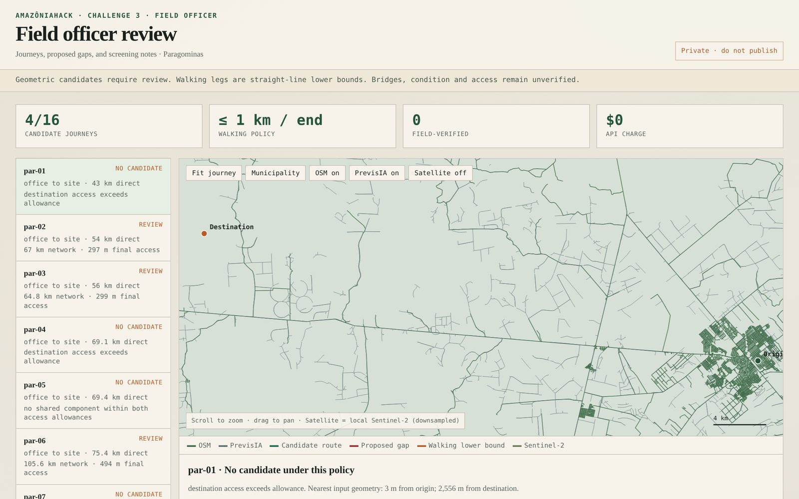
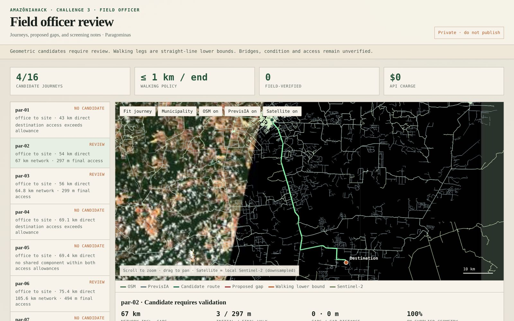
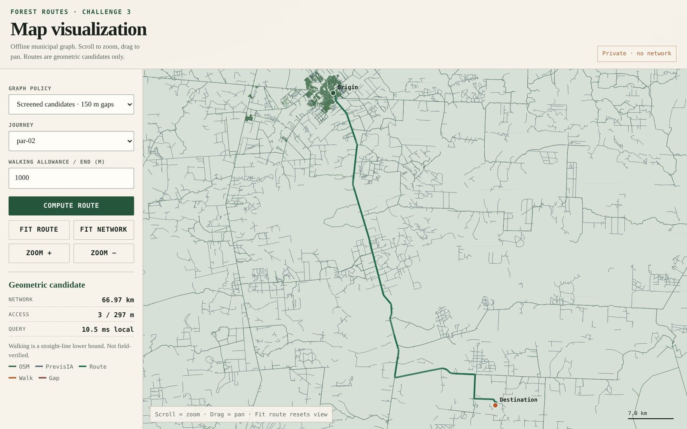

# Forest Routes

**AmazôniaHack 4.0 · Challenge 3** — offline route feasibility for unmapped Amazon roads.

Inspection sites sit off the official OSM network. Imazon PrevisIA adds detected rural traces, but they are fragmented — not a ready graph. Blind snapping invents junctions. Forest Routes measures connectivity, keeps walking and gaps explicit, screens evidence, and ships two private offline dashboards.

| Screened policy (150 m gaps · 1 km walk / end) | Result |
|---|---|
| Geometric candidates | **4 / 16** |
| Field-verified | **0** |
| External API charge | **US$0** |

> Exploratory connectivity (before gap screening) reaches 10/16. Raising a coverage count is not evidence that a journey is real.

---

## Dashboards

Two offline tools (generated locally; **not** published with participant coordinates):

<p align="center">
  
</p>

### Field officer review

Inspect the 16 journeys, OSM / PrevisIA layers, proposed gaps, walking legs, screening notes, and an optional Sentinel-2 layer.

<p align="center">
  
</p>

<p align="center">
  
</p>

### Map visualization

Compute a fresh route on the municipal graph in the browser — scroll to zoom, drag to pan, no server or API.

<p align="center">
  
</p>

---

## What it does

1. **Build graphs** from OSM + PrevisIA (shared vertices, planar noding, explicit 50 / 150 / 300 m gap proposals).
2. **Attach** origin and destination with a declared walking allowance at **both** ends (default 1 km). Walking is a straight-line lower bound, not a verified footpath.
3. **Route** with weighted Dijkstra (prefer real roads over invented gaps over walking).
4. **Review** doubtful gaps (imagery, rivers, elevation). Quarantine or retain only screened candidates — then rerun the same policy.
5. **Export** a compact municipal graph + self-contained HTML dashboards for offline use.

## Evidence sought (challenge “missing on purpose”)

| Source | Status |
|---|---|
| Sentinel-2 imagery | Downloaded locally; gap chips + satellite map layer |
| River crossings | ANA centerlines intersected with routes (flags, not “no bridge”) |
| Elevation | Copernicus GLO-30 sampled along candidates |
| Seasonal passability | Unknown — stated as such |
| PrevisIA trace age | Unknown (Imazon dates not provided) — stated as such |

**Zero routes are field-verified.**

---

## Quick start

Public repo has **no** participant GeoJSON or site coordinates. Use your authorised Challenge 3 folder:

```bash
cd challenge3
python3 -m venv .venv
.venv/bin/pip install -r requirements.txt
PYTHONPATH=src .venv/bin/python -m unittest discover -s tests -v
PYTHONPATH=src .venv/bin/python -m forest_routes.benchmark \
  --data-dir "/path/to/Challenge 3" --output private/results \
  --vehicle-only --reject-gaps evidence/quarantined-gap-ids.json \
  --screened-gaps evidence/screened-candidate-gap-ids.json --export-graph
```

Then open:

- `private/results/report.html` — field officer review  
- `private/results/offline-router.html` — map visualization  

Or serve privately:

```bash
python3 -m http.server 8765 --bind 127.0.0.1 --directory private
```

## Repository layout

```
challenge3/
  src/forest_routes/   # CLI, router, report templates
  tests/               # topology + feedback tests
  evidence/            # gap quarantine / screened policy IDs
  examples/            # synthetic feedback fixtures only
  public/dist/         # submission zip, results.json, one-pager
  SUBMISSION.md        # hackathon form paste text
  docs/screenshots/    # README images (local dashboard captures)
```

`Incubation material/` and `challenge3/private/` are gitignored.

## Submission

- Form text: [`challenge3/SUBMISSION.md`](challenge3/SUBMISSION.md)
- Technical note: [`challenge3/public/dist/submission.md`](challenge3/public/dist/submission.md)
- Aggregate results: [`challenge3/public/dist/results.json`](challenge3/public/dist/results.json)
- Source archive: [`challenge3/public/dist/forest-routes-source.zip`](challenge3/public/dist/forest-routes-source.zip)

## Licence / data

- Code in this repo: provided for AmazôniaHack evaluation.
- OSM: ODbL.
- Participant PrevisIA / test pairs: **not redistributed** here. Delete supplied data and coordinate-bearing derivatives after the event as required.
